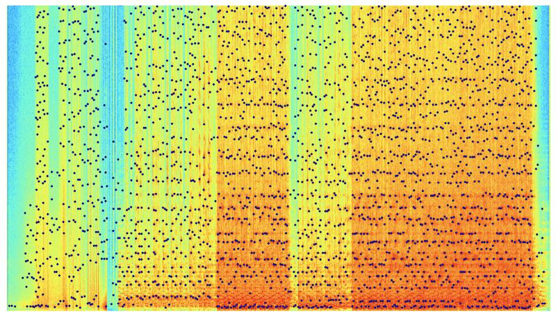

# Shezem-rs
## About
A Rust implementation of a fast audio fingerprinting system inspired by Shazam, for audio recognition and identification. It focuses on speed, efficiency and simplicity.

## Usage
### Build
```bash
# Clone the repository
git clone https://github.com/username/shezem-rs.git
cd shezem-rs

# Build the project
cargo build --release

# The executable will be available at
# ./target/release/shezem-rs
```

The CLI provides two main commands: `index` and `search`

### Indexing Audio Files

To create an index of audio files in a directory:

```bash
shezem-rs index /path/to/audio/folder
```

This will create a `.db` folder in the specified directory and store the database file (`db.db3`) inside it.

### Searching for Similar Audio

To find similar audio files to a query file:

```bash
shezem-rs search /path/to/query.mp3 --path /path/to/indexed/folder
```

By default, this will return the top 10 matches. You can change the number of results with the `--rank` option:

```bash
shezem-rs search /path/to/query.mp3 --path /path/to/indexed/folder --rank 5
```
## Performance
Performance benchmarks were conducted on a collection of 100 songs totaling approximately 1.1GB, using an AMD Ryzen 5 5600H (12) @ 4.28 GHz processor:

- **Indexing Speed**: Complete folder indexing was accomplished in 35.5 seconds
- **Search Performance**:
  - 10-second audio sample search: 0.3 seconds
  - 3-minute audio sample search: 1.02 seconds

## How it works
The algorithm is based on a fingerprinting system, heavily inspired by this article:
[How does Shazam work - Coding Geek](https://drive.google.com/file/d/1ahyCTXBAZiuni6RTzHzLoOwwfTRFaU-C/view)

While working on the audio fingerprinting process, I developed some interesting approaches that I believe are both faster and more efficient. I'll explain them in detail here.

### Preprocessing
First, we need to convert the audio from stereo to mono by averaging the left and right channels. To reduce computational load, we also downsample the audio, which decreases the number of samples we need to process. Most downloaded songs have a sampling rate of 44.1kHz, but we'll downsample it to 11.025kHz. Before doing so, we must filter out any frequencies above the [Nyquist frequency](https://en.wikipedia.org/wiki/Nyquist_frequency) to prevent aliasing. We can achieve this by applying a simple [IIR low-pass filter](https://tomroelandts.com/articles/low-pass-single-pole-iir-filter).

### Spectrogram
The audio is transformed into a spectrogram using a Short-Time Fourier Transform (STFT) with a 1024-sample Hamming window and 50% overlap between adjacent windows. This creates a time-frequency representation of the audio signal.

To identify significant features, the algorithm divides the frequency spectrum into discrete bands for each time window. Within each band, only the maximum amplitude is preserved. The system then applies a threshold filter, eliminating any bands with amplitudes below the average level. The remaining high-energy points constitute the characteristic peaks of the spectrogram, which serve as the audio fingerprint.



### Storing Fingerprint
After getting the peaks from spectrogram, How can we store and use it in an efficient way? We’ll do this by using a hash function. Here we will combine some adjacent peaks to form a group of peaks. This group will have an anchor, then we address other peaks inside the group using that anchor. The address will be identified by (anchor frequency, peak frequency, delta time between peaks and anchor). This tuple is easily fits in a 32-bit integer. To advance 64 bits, I also store the anchor address along with each peak.

### Searching and Ranking
When identifying matching audio, the system first processes the input sample to create a fingerprint. After retrieving potential matching fingerprints from the database, the algorithm performs a temporal coherence analysis by sorting the retrieved fingerprints according to their chronological appearance in the sample.

The system then calculates the longest increasing subsequence of these sorted fingerprints, ensuring that the detected peaks maintain the same sequential order as in the original audio. To address the challenge of false positives when comparing short samples against longer recordings, the algorithm implements a sliding window technique. This approach identifies the window with the highest concentration of matching peaks and uses this density for the match score calculation. Final results are then ranked according to these match scores, with higher scores indicating stronger matches.
